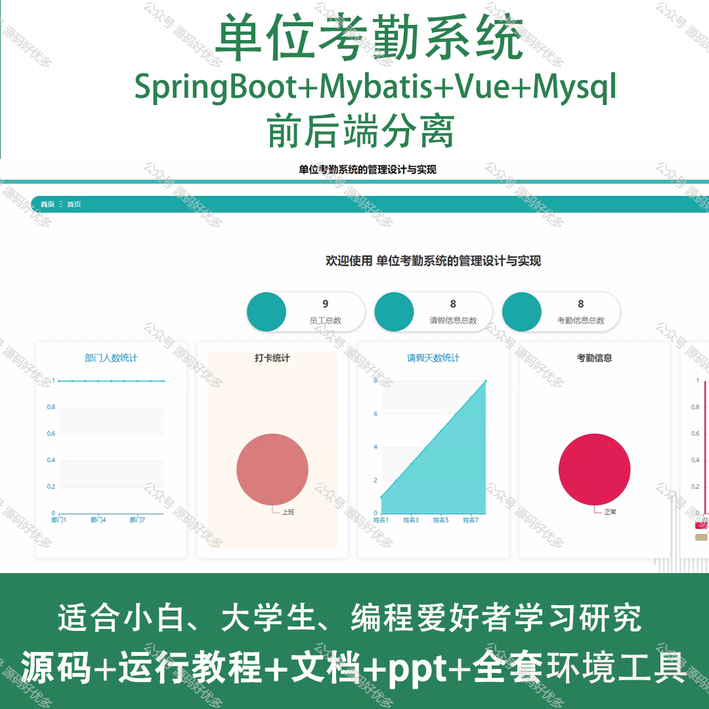
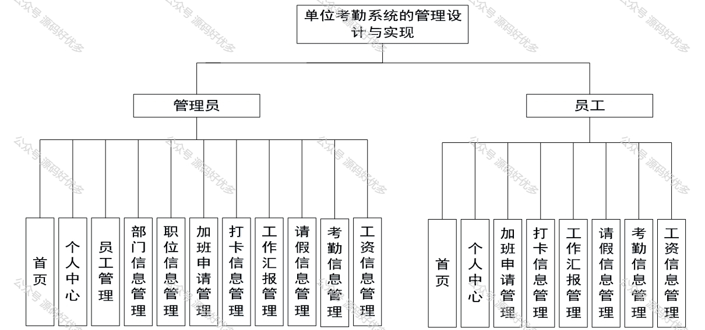
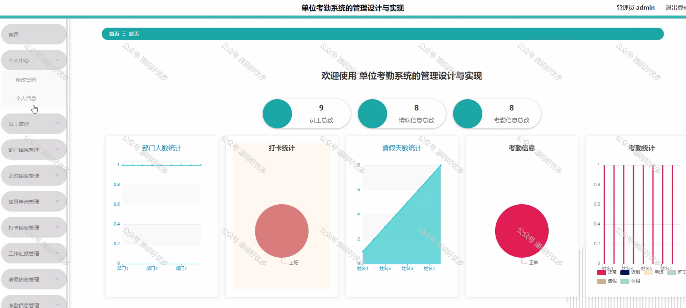
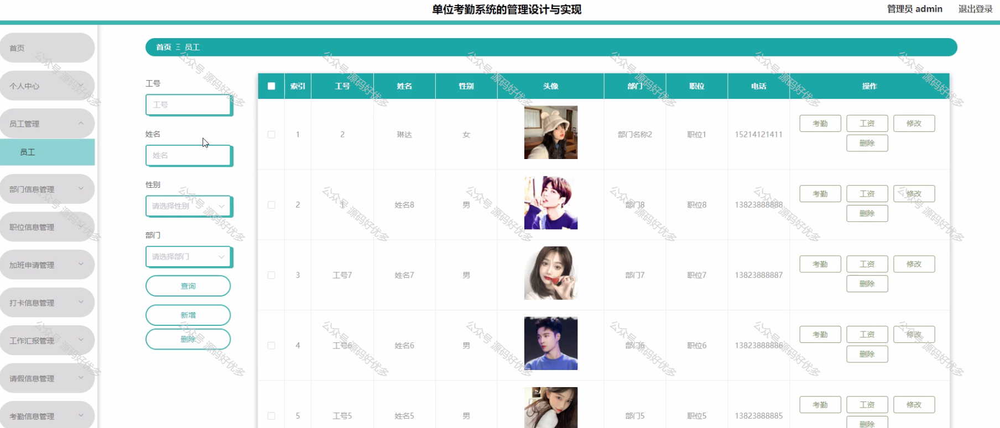
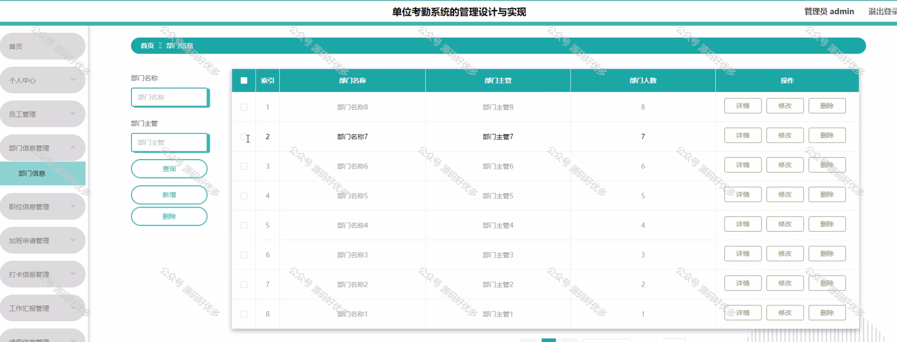
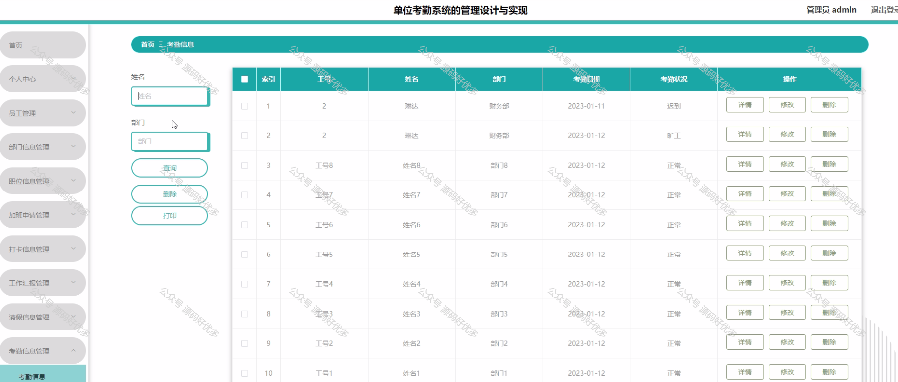
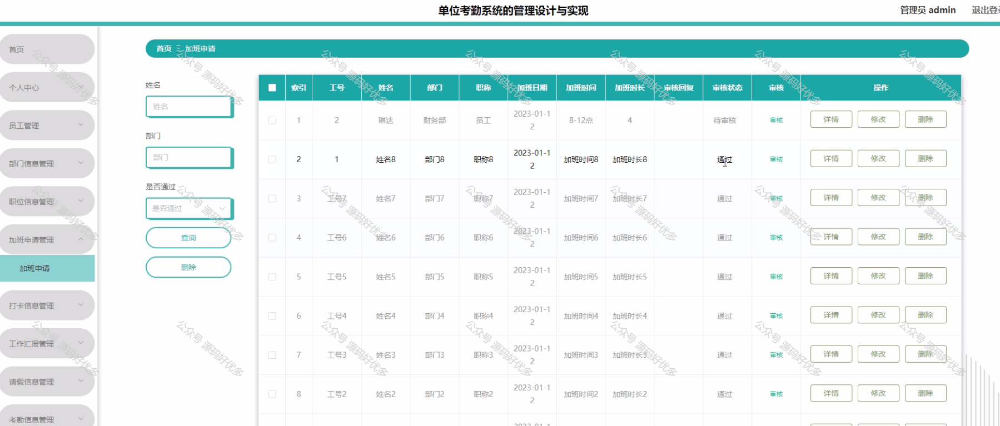
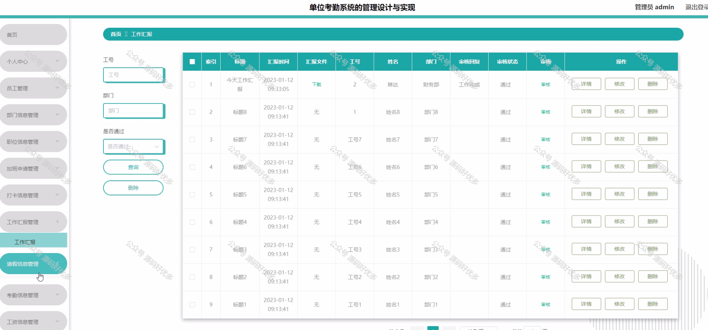
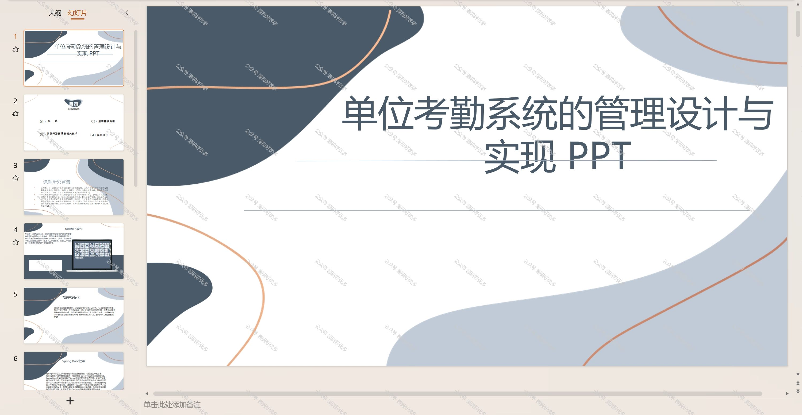
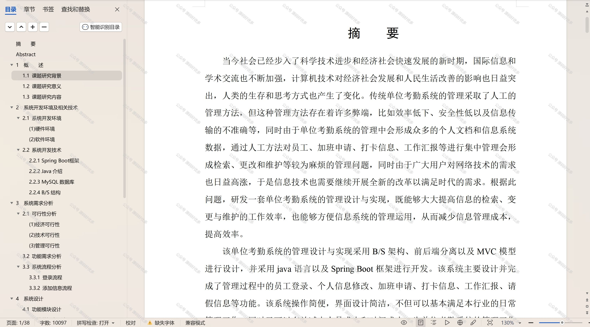

 
## 查看主页获取源码

> **作者介绍**： **✌**全网粉丝10W+本平台特邀作者、博客专家、CSDN新星计划导师、java领域优质创作者,博客之星、掘金/华为云/阿里云/InfoQ等平台优质作者、专注于项目实战 **✌**

  

### 一、作品包含

源码+数据库+设计文档万字+PPT+全套环境和工具资源+部署教程

### 二、项目技术

前端技术：Html、Css、Js、Vue、Element-ui

数据库：MySQL

后端技术：Java、Spring Boot、MyBatis

  

### 三、运行环境

开发工具：IDEA/eclipse

数据库：MySQL5.7

数据库管理工具：Navicat10以上版本

环境配置软件： JDK1.8+Maven3.6.3

前端Nodejs：14

### 四、项目介绍
项目编号：springbootA143

单位考勤系统是为了提高企业管理效率，确保员工出勤记录的准确性和公正性而设计的一套信息化管理工具。通过该系统，企业能够实时监控员工的上下班打卡情况，从而便于人力资源部门进行薪酬核算和工作绩效评估。此外，考勤系统还有助于规范员工行为，增强企业的纪律性，为创建公平、高效的工作环境提供技术支持。

系统分为管理员和员工
管理员的功能：首页、个人中心、员工管理、部门信息管理、职位信息管理、加班申请管理、打卡信息管理、工作汇报管理、请假信息管理、考勤信息管理、工资信息管理。
员工的功能：首页、个人中心、加班申请管理、打卡信息管理、工作汇报管理、请假信息管理、考勤信息管理、工资信息管理。

### 五、运行截图

  
